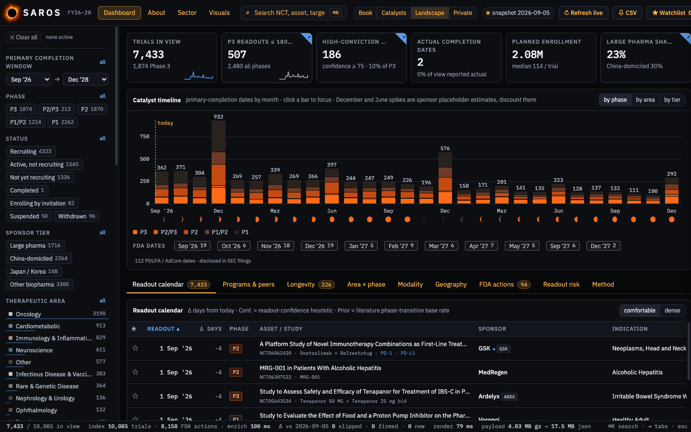

# SAROS


**A navigator of today's clinical-trial landscape, mapped to the money around it. Its horizon spans 2026–2028. Public sources only, refreshed weekly.**

Live at [saros.gcarosso.bio](https://saros.gcarosso.bio). Built by [Giovanni Carosso](https://gcarosso.bio).



SAROS is a clinical trial readout calendar for specialist biotech investors. It holds every industry-sponsored Phase 1–3 trial registered on ClinicalTrials.gov with a primary-completion date in 2026–2028 (10,000+), and joins each one to what public filings say about the sponsor: cash and runway from SEC XBRL, specialist-fund ownership from 13F, insider trades from Form 4, PDUFA and advisory-committee dates as disclosed in SEC filings, private rounds from Form D, NIH awards, and a curated mechanism note. It is a single HTML file with no server. A plain-text summary of the method is at [saros.gcarosso.bio/method.html](https://saros.gcarosso.bio/method.html).

## What you can do with it

- **See what reads out when** — 10,000+ trials by registered primary-completion month; filter by phase, status, area, modality, sponsor tier, target or enrollment; click any bar, cell or sponsor to focus.
- **Open a dossier** — next action and the rule behind it, readout confidence with reasons, cash-to-event, holders, insider trades, mechanism, an editable rNPV sketch, and every competing trial in the indication.
- **Search by target** — KRAS, GLP-1, CD19… tagged by a curated mechanism lexicon.
- **Check the FDA calendar** — PDUFA, advisory-committee and resubmission dates exactly as companies disclosed them, each linked to its filing.
- **Look inside private sponsors** — Regulation D placements (amounts, dates, investors, officers) and NIH awards.
- **Track what changed** — each weekly build is diffed against the last; slipped, firmed and new trials are flags.

## Data sources

All public, all free. Method → Data provenance inside the app has the exact queries and pull dates.

| Source | Contributes | Cadence |
|---|---|---|
| [ClinicalTrials.gov API v2](https://clinicaltrials.gov/data-api/api) | the trial universe | weekly; live delta on demand |
| [SEC EDGAR full-text search](https://efts.sec.gov/LATEST/search-index) | PDUFA / AdCom / resubmission dates from 8-K, 6-K, 10-Q, 10-K | weekly |
| [SEC XBRL frames](https://www.sec.gov/edgar/sec-api-documentation) + company tickers | cash, R&D, net income, revenue, public float, shares | weekly |
| [SEC EDGAR 13F-HR](https://www.sec.gov/cgi-bin/browse-edgar) | positions of ~30 biotech-specialist funds | quarterly |
| [SEC insider-transactions data sets](https://www.sec.gov/data-research/sec-markets-data/insider-transactions-data-sets) | Form 4 open-market buys and sells | quarterly |
| [SEC Form D data sets](https://www.sec.gov/data-research/sec-markets-data/form-d-data-sets) | Regulation D placements by biotech / pharma issuers | quarterly |
| [NIH RePORTER](https://api.reporter.nih.gov/) | NIH research awards | weekly |
| [openFDA Drugs@FDA](https://open.fda.gov/apis/drug/drugsfda/) | approval actions since 2025 | weekly |
| Wong, Siah & Lo (2019) | phase-transition base rates | static |

## Quickstart

```bash
git clone https://github.com/gcarosso/saros && cd saros
python3 -m venv .venv && .venv/bin/pip install -e ".[dev]"
make pull      # ≈ 15–30 min: every source above, politely rate-limited
make process   # raw pulls → data/snapshot.json.gz
make build     # → dist/saros.html (standalone, ≈ 6 MB) and dist/artifact.html
make test
open dist/saros.html
```

`make refresh` runs the whole chain; `launchd/` schedules it weekly on a Mac. The pipeline is standard-library Python;
`node` is needed only for the JS syntax test and Google Chrome only for the headless render test.

## What it will not tell you

- **Registered dates lag real readouts.** A primary-completion date is when a readout can first exist, not when it will land; open-label early-phase programs drift the most, and June and December pile-ups are sponsor placeholders.
- **Private companies stay opaque.** Round valuations, terms, cap tables and private burn are not public; they are shown as unknown, never estimated.
- **Out of scope by design:** vendor likelihood-of-approval scores, paid consensus, deal terms and prescription data.
- Nothing here is investment advice.

## Layout

```
src/            head.html (CSS), body.html, app1.js (model, charts), app2.js (views), pages/ (About, Sector, Visuals, glossary, logo)
data/           pull*.py (one per source), process.py (→ snapshot), diff.py (week-over-week), moa_lexicon.py
build.py        stitches src + gzip/base64 snapshot into one file
tests/          pytest: lexicon, pipeline shapes, pullers' parsers, diff, headless render
public/brand/   the mark
docs/           design notes and scoping documents
```

See `CLAUDE.md` for the full project brief and conventions.

## Licence

Apache-2.0 — see [LICENSE](LICENSE). Copyright 2026 Giovanni A. Carosso.
